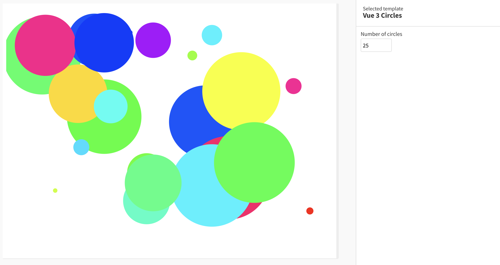

# Example Flourish Vue 3 template

This simple example uses [Vue 3]((https://v3.vuejs.org/) to draw a specified number of colorful circles at random positions, radii & colors. It demonstrates the use of settings in a Vue 3 context.

## How this works

- `template.yml` has a setting for the number of circles
- `src/main.js` sets up the `data` and `state` objects as well as the `draw()` and `update()` functions that are required in a Flourish template
- In `src/App.vue` an SVG is created that draws the specified number of circles with randomized positions, radii & colors that animate in & out as you change the number of circles

## How to run this

- [Install Flourish](https://flourish.studio/developers/) and use `flourish run` to run the template
- More info about publishing a template to Flourish [can be found here](https://flourish.studio/developers/quickstart/publish-to-flourish/)